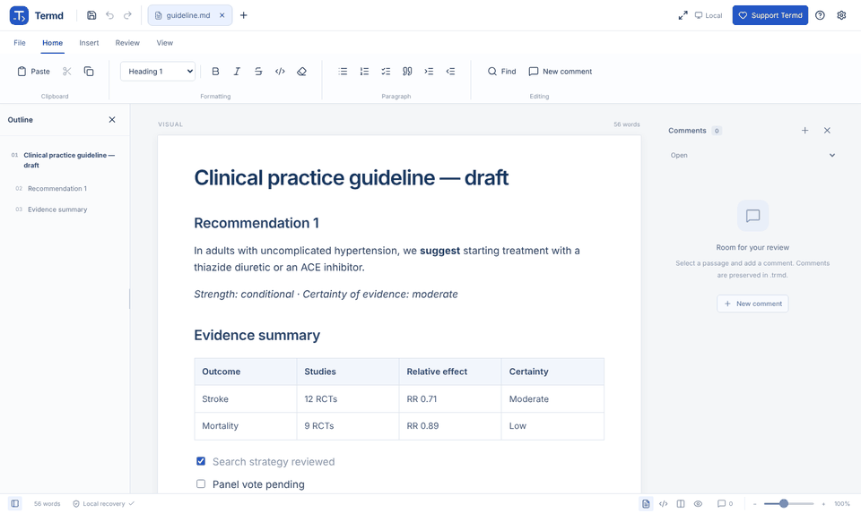
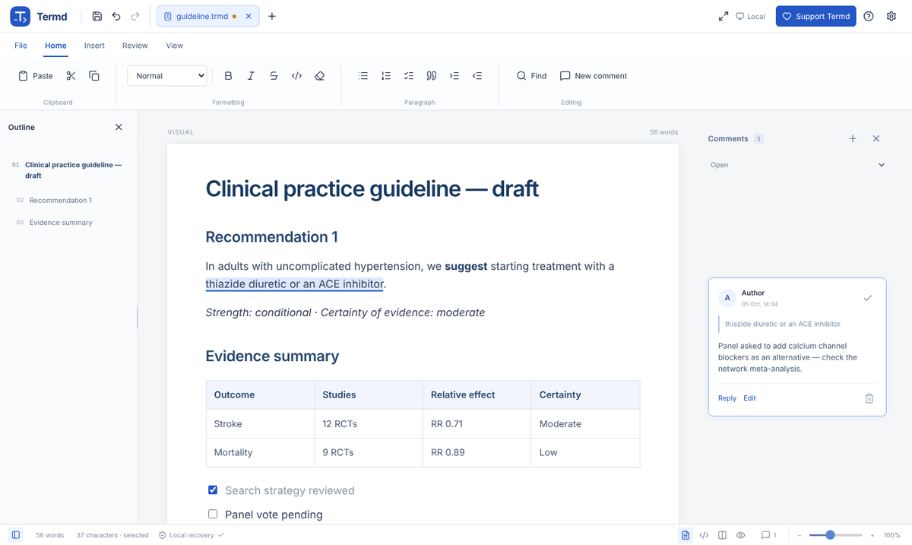
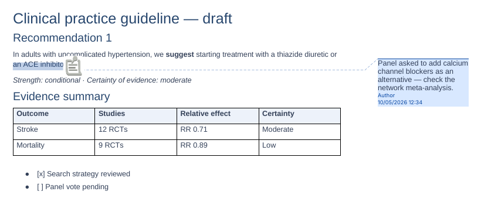

# Termd

English · [Español](README.es.md)

**Review Markdown like you review in Word.** Termd is a Markdown editor with a word-processor interface, a code view, and comment threads in the margin — and it exports those comments as real Word comments.

**[Open Termd →](https://aydearcas.github.io/termd/)** · [Download the offline version (Termd.html)](https://aydearcas.github.io/termd/Termd.html) · [Changelog](CHANGELOG.md)



## Why Termd

- **Comments that travel.** Select a passage, comment, reply and resolve. Comments live in `.trmd` files and export to `.docx` as native Word comments, so reviewers who only use Word can read them.
- **Your Markdown stays yours.** Unedited files are saved byte for byte (BOM and line endings included). Constructs the visual editor does not handle — front matter, HTML, Mermaid, references — are protected instead of rewritten.
- **Visual, code or both.** Edit in a familiar ribbon interface, in Markdown, or in a split view where both panes are editable and synchronized.
- **Local first.** No account and no document server. Files open from your device; drafts are recovered from your browser.

| Comments in the margin | Exported to Word (shown in LibreOffice) |
|---|---|
|  |  |

## Features

- Visual and Markdown code editors, plus a split view with both panes editable and synchronized.
- Multiple documents in tabs, a resizable outline, and contextual table tools.
- Standard Markdown (`.md`) and commented Markdown (`.trmd`). The first comment converts a Markdown document in memory; you choose when to save it.
- Resizable images; pasted screenshots are kept inside the document.
- Print, direct paginated PDF export, and editable DOCX export with optional comments. See [export details](docs/EXPORTACION.md).
- Find and replace, focus mode, fullscreen, zoom, and document statistics.
- English and Spanish interface.

### File formats

- **`.md`** is standard Markdown for use with any editor.
- **`.trmd`** keeps Markdown, comments and local images together in one file. See [docs/TRMD.md](docs/TRMD.md). You can save a plain `.md` copy from a `.trmd` document; comments are not included in that copy.

## Using Termd

- **Online:** https://aydearcas.github.io/termd/ — works best in Chrome or Edge, which allow saving directly to the opened file. Other browsers download a copy.
- **Offline:** download [Termd.html](https://aydearcas.github.io/termd/Termd.html) and open it in your browser. It is self-contained and makes no network requests.

Termd does not send your documents anywhere. Recovery drafts are stored in your browser and depend on the address you open Termd from. Save your files to keep an independent copy. If you enable external images, your browser loads them from their servers.

More detail (in Spanish) in [LEEME.md](LEEME.md).

## Development

Requires Node.js 22.13 or later.

```bash
npm ci
npm run dev        # development server
npm test           # core tests
npm run build      # build into dist/
node scripts/package.cjs   # build Termd.html from dist/
npm run format     # format with Prettier
```

Browser test suites live in `tests/*.cjs` and need a Chromium binary set in `TERMD_BROWSER`. See [docs/VERIFICACION.md](docs/VERIFICACION.md) (Spanish).

### How publishing works

- Pushing to `develop` (or opening a pull request to `main`) runs **Comprobar Termd**: install, tests, build, and a downloadable build artifact to try before merging.
- Merging into `main` runs **Publicar Termd**: it builds `dist/` from scratch, generates `Termd.html`, and deploys to GitHub Pages. If tests or the build fail, nothing is deployed and the previous version stays online.

`dist/` and `Termd.html` are build outputs and are not stored in the repository. Step-by-step update guide (Spanish): [ACTUALIZAR_GITHUB.md](ACTUALIZAR_GITHUB.md).

## License

[MIT](LICENSE) © 2026 Aythami de Armas Castellano. Third-party components keep their own licenses; see [THIRD_PARTY_NOTICES.txt](THIRD_PARTY_NOTICES.txt). Documents you create with Termd are yours.

## Support Termd

Termd is free. If you find it useful, you can [support its development through PayPal](https://paypal.me/aydearcas). Contributions are voluntary and do not unlock features.
