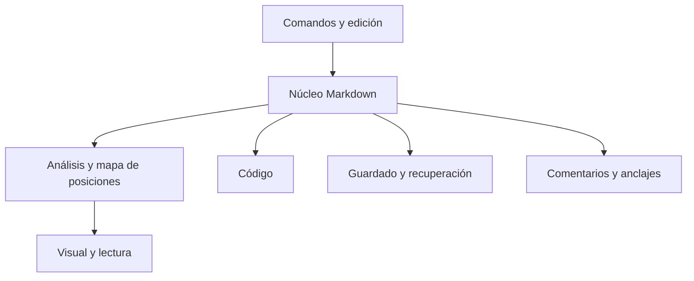

> Plan histórico. Para los formatos de la versión actual y el guardado integrado de comentarios consulta `TRMD.md` y `../LEEME.md`.

# Plan de desarrollo de una webapp local para leer y editar Markdown

**Fecha:** 30 de septiembre de 2026  
**Versión:** 1.0 — especificación funcional y técnica para guiar el desarrollo  
**Nombre provisional:** Markdown Desk  
**Producto:** aplicación local de escritorio en el navegador, con edición visual, edición de código y lectura.

## 1. Objetivo y decisiones principales

Crear una aplicación que permita trabajar con archivos Markdown con la comodidad de un procesador de texto: abrir documentos, leerlos con una presentación cuidada, escribir directamente sobre una vista con formato, insertar estructuras mediante botones y revisar el contenido con comentarios en el margen derecho.

La interfaz tomará como referencia la organización de Word 365: barra superior, pestañas de herramientas, estilos de párrafo, documento central y barra de estado. Tendrá identidad propia, con predominio de blanco, gris claro y azul, sin copiar recursos gráficos de Microsoft.

El resultado principal seguirá siendo un archivo `.md` legible y editable con otras aplicaciones. Las decisiones de diseño propuestas son las siguientes:

| Aspecto | Decisión propuesta | Consecuencia práctica |
|---|---|---|
| Edición habitual | Modo visual como predeterminado | Se escribe sobre títulos, párrafos y tablas ya representados. |
| Acceso al original | Modo Código disponible en todo momento | Se puede consultar y modificar la sintaxis exacta. |
| Lectura | Modo Lectura sin herramientas de edición intrusivas | Navegación por índice y comentarios, con mayor espacio para el texto. |
| Comparación | Modo Dividido: código y vista previa | Permite comprobar qué produce cada estructura. |
| Formato base | CommonMark con extensiones GFM seleccionadas | Tablas, tachado, listas de tareas y enlaces automáticos. |
| Fidelidad | El texto Markdown es la fuente principal | Abrir o cambiar de modo no debe reformatear el archivo. |
| Comentarios | Margen derecho y archivo auxiliar JSON | El `.md` conserva su portabilidad; los comentarios se recuperan por separado. |
| Guardado | Guardar en el archivo cuando el navegador lo permita; descargar una copia como alternativa | La aplicación comunica claramente qué operación se ha realizado. |
| Ejecución | Servidor estático local y aplicación sin servicios externos obligatorios | Se trabaja sin conexión una vez instalada la distribución. |
| Idiomas | Español e inglés desde la primera versión | Se traduce la interfaz, sin traducir el documento. |

CommonMark proporciona la base de sintaxis; GFM añade, entre otras funciones, tablas y listas de tareas. Las notas al pie, fórmulas y diagramas se tratarán como extensiones adicionales, con su compatibilidad indicada expresamente [1–3].

### 1.1. Qué debe significar «parecida a Word»

La similitud estará en los flujos y controles: seleccionar, aplicar formato, insertar una tabla, elegir un nivel de título, comentar, buscar y guardar. No conviene introducir botones cuyo efecto no pueda mantenerse al abrir el `.md` en otro editor.

Por tanto, se distinguirán tres clases de ajustes:

- **Estructura del documento:** títulos, listas, tablas, citas, enlaces y código; modifican el Markdown.
- **Presentación de la aplicación:** tipografía de lectura, tamaño, ancho, interlineado y zoom; modifican cómo se ve, sin alterar el archivo.
- **Funciones ampliadas:** HTML u otras extensiones; se conservan cuando ya existen, pero su edición visual se habilita únicamente cuando esté implementada y probada.

### 1.2. Escenario de uso prioritario

Uso individual en un ordenador, con documentos de trabajo que pueden contener texto extenso, tablas, enlaces, listas y comentarios. Se priorizará inicialmente Windows con Chrome y Edge, manteniendo una alternativa funcional de apertura y descarga en Firefox y Safari. La disponibilidad de las APIs se detectará en ejecución; no se deducirá solo del nombre del navegador [4–5].

## 2. Diseño de la interfaz

### 2.1. Distribución de la ventana

| Zona | Contenido | Comportamiento |
|---|---|---|
| Barra superior | Nombre de la aplicación, nombre del archivo, estado de guardado, acceso a configuración | Altura aproximada de 48–52 px; siempre visible. |
| Pestañas | Archivo, Inicio, Insertar, Revisar, Vista | Seleccionan los grupos de comandos de una cinta compacta. |
| Cinta de herramientas | Botones y selectores de la pestaña activa | Una fila principal y, cuando sea necesario, una segunda; puede contraerse. |
| Navegación | Índice de títulos y, posteriormente, documentos abiertos | Panel lateral plegable; separado del margen de comentarios. |
| Margen de comentarios | Tarjetas vinculadas al texto | Siempre a la derecha del documento cuando esté desplegado. |
| Documento | Hoja blanca continua sobre fondo gris claro | Ancho de lectura cómodo; tablas anchas con desplazamiento propio. |
| Barra de estado | Palabras, selección, modo, estado de comentarios, zoom | Permite cambiar de modo y ajustar la visualización. |

La hoja será continua. No se simulará paginación real durante la edición: Markdown no define páginas. La impresión tendrá un diseño específico y sus propias reglas de salto.

### 2.2. Sistema visual

| Elemento | Propuesta |
|---|---|
| Fondo general | `#F4F6F8` |
| Superficies | Blanco `#FFFFFF` |
| Bordes | Gris claro `#D8DEE8` |
| Texto principal | `#1F2937` |
| Texto secundario | `#556274` |
| Azul principal | `#2457C5` |
| Superficie azul suave | `#EAF1FF` |
| Selección | Fondo azul translúcido, conservando el contraste del texto |
| Comentario seleccionado | Borde azul e indicador junto al fragmento asociado |
| Tipografía de interfaz | Familia del sistema: Segoe UI, system-ui y alternativas disponibles |
| Tipografía del documento | Sans serif legible por defecto; alternativa serif |
| Código | Familia monoespaciada local |
| Iconos | Un único conjunto coherente, acompañado de etiquetas y ayudas |
| Controles | Altura aproximada de 32–36 px; objetivos táctiles mayores cuando proceda |

Las cifras son tokens iniciales de diseño, no una garantía de accesibilidad: el contraste y el comportamiento se comprobarán en la implementación. Los estados «guardado», «error» y «comentario sin anclaje» tendrán texto o icono, además de color.

### 2.3. Comportamiento según el espacio disponible

- **Ventana amplia:** cinta completa, margen derecho con tarjetas e índice a la izquierda, opcional.
- **Ventana intermedia:** se contrae primero el índice; el margen de comentarios conserva prioridad.
- **Ventana estrecha:** grupos de herramientas en menús; comentarios en un cajón que se abre desde la derecha.
- **Modo concentración:** oculta cinta e índice; permite mostrar u ocultar comentarios independientemente.

El documento no debe quedar desplazado o reducido de forma brusca al abrir un comentario. Se mantendrán el cursor y el fragmento visible.

## 3. Modos de lectura y edición

| Modo | Uso | Herramientas |
|---|---|---|
| Visual | Redactar como en un procesador de texto | Cinta, burbuja, menú contextual, tablas editables y comentarios. |
| Código | Editar el Markdown exacto | Resaltado de sintaxis, números de línea opcionales, búsqueda y comandos que insertan sintaxis. |
| Dividido | Código editable y vista previa de lectura | Paneles redimensionables y sincronización por bloques. |
| Lectura | Leer, navegar y revisar | Índice, búsqueda y comentarios; el texto principal no es editable. |

### 3.1. Reglas de cambio de modo

1. Los modos comparten el mismo documento, estado de cambios e historial.
2. Cambiar de modo no guarda automáticamente en disco ni crea una versión reformateada.
3. Se conserva la posición mediante el bloque y la selección asociados, no mediante porcentajes de desplazamiento.
4. La vista previa refleja el contenido vigente, con un pequeño retraso controlado durante la escritura.
5. Solo una superficie edita el documento en cada momento. En Dividido, la vista previa es de lectura.
6. Una composición de texto activa, por ejemplo con un método de entrada, se termina de forma segura antes del cambio.

### 3.2. Compatibilidad de la edición visual

La primera versión editará visualmente párrafos, títulos H1–H6, formatos en línea, enlaces, listas, citas, tablas GFM simples, imágenes y bloques de código. El resto del contenido se preservará en su forma original.

Un bloque que la aplicación no pueda representar y editar con fidelidad se mostrará como **«Bloque avanzado — editar en Código»**, con una vista segura del original. Esto incluye inicialmente HTML complejo, directivas de otros editores, fórmulas o diagramas sin extensión habilitada y tablas con estructuras ajenas a GFM.

Las construcciones desconocidas en línea exigirán proteger el párrafo contenedor si no pueden conservarse de forma independiente. Los enlaces por referencia y definiciones compartidas deberán resolverse sin eliminar sus definiciones. Si la edición requiere una conversión local de sintaxis, se ofrecerá una vista del cambio y una acción explícita para aceptarla.

La garantía exigible es que el contenido no se pierda silenciosamente. No se prometerá edición visual universal de cualquier dialecto Markdown.

## 4. Organización de comandos como procesador de texto

### 4.1. Pestañas de la cinta

| Pestaña | Grupos | Comandos principales |
|---|---|---|
| Archivo | Documento; guardado; salida | Nuevo, abrir, recientes, guardar, guardar como, descargar Markdown, exportar documento y comentarios, imprimir. |
| Inicio | Portapapeles; formato; párrafo; edición | Cortar, copiar, pegar, negrita, cursiva, tachado, código, estilo de párrafo, listas, cita, quitar formato, deshacer, rehacer, buscar. |
| Insertar | Estructuras; referencias | Tabla, enlace, imagen, separador, bloque de código, lista de tareas; notas al pie en una fase posterior. |
| Revisar | Comentarios; lectura del documento | Nuevo comentario, anterior/siguiente, resolver, filtros, estadísticas y avisos de compatibilidad. |
| Vista | Modos; disposición; lectura | Visual, Código, Dividido, Lectura, índice, comentarios, concentración, zoom, ancho y ajuste de líneas. |

Al seleccionar una tabla aparecerá un grupo contextual **Tabla**, sin añadir permanentemente otra pestaña. Lo mismo ocurrirá con enlaces, imágenes y bloques de código.

### 4.2. Equivalencias de edición

Los ejemplos de la tabla describen la salida de los botones, no todo el comportamiento del parser.

| Control familiar | Equivalencia Markdown | Regla del editor |
|---|---|---|
| Estilo Normal | Párrafo sin marcador | Cambia el tipo del bloque, conservando el texto. |
| Título 1–6 | `#` a `######`, seguidos de espacio | Aplica el nivel al bloque actual o a los párrafos seleccionados. |
| Negrita | `**texto**` | Alterna el formato sin acumular delimitadores. |
| Cursiva | `*texto*` | Usa delimitadores válidos en el contexto. |
| Tachado | `~~texto~~` | Extensión GFM. |
| Código en línea | Delimitadores de acentos graves | Ajusta su longitud si el contenido ya contiene ese carácter. |
| Viñetas | `- elemento` | Convierte párrafos en elementos de lista. |
| Lista numerada | `1. elemento` | Mantiene la estructura y el número inicial cuando corresponda. |
| Lista de tareas | `- [ ] tarea` / `- [x] tarea` | La casilla modifica el Markdown. |
| Cita | `> texto` | Soporta varios párrafos y niveles controlados. |
| Enlace | `[texto](destino)` | Diálogo con texto, destino y título opcional. |
| Imagen | `` | Se solicita descripción y destino. |
| Tabla | Cabecera, separadores y celdas con barras verticales | Editor de filas, columnas y alineación. |
| Separador | Línea `---` aislada | Inserta líneas en blanco para evitar ambigüedades con otros bloques. |
| Bloque de código | Bloque cercado con lenguaje opcional | Preserva el texto literal y elige una cerca que no entre en conflicto. |
| Quitar formato | Elimina las marcas compatibles seleccionadas | Conserva el texto; no borra estructuras desconocidas. |

### 4.3. Controles que necesitan una adaptación

| Función de Word | Propuesta en la webapp |
|---|---|
| Tamaño de letra por selección | Sustituirlo por estilos de párrafo. Ofrecer tamaño de visualización por separado. |
| Fuente, interlineado y ancho | Preferencias de lectura del documento, sin escribir estilos en el `.md`. |
| Alineación de párrafos y justificación | No incluirlas como formato persistente en la primera versión. |
| Alineación dentro de tablas | Sí: generar los marcadores de alineación de GFM. |
| Color de texto y resaltado persistente | Reservar para un perfil ampliado; no insertar HTML de estilo automáticamente. |
| Subrayado | No incluir como botón habitual; no tiene una equivalencia estándar y puede confundirse con enlaces. |
| Sangría | Aplicarla a listas y citas; no introducir espacios arbitrarios en párrafos. |
| Control de cambios | Comentarios e historial de recuperación inicialmente; seguimiento de cambios formal como ampliación. |
| Saltos de página | Preferencias de impresión; no introducir una sintaxis supuestamente universal. |

La interfaz debe explicar estas adaptaciones con ayudas breves. Ejemplo: **«El tamaño cambia la visualización. Para crear un encabezado, usa Título 1–6»**.

## 5. Comportamiento de las herramientas de edición

### 5.1. Títulos y estilos

El selector ofrecerá Normal y Título 1–6, con una muestra del aspecto de cada opción. No utilizará «Título del documento» como un formato incompatible adicional: podrá recomendar H1 para ese uso.

Al aplicar un título sobre una selección parcial, se cambiará el párrafo completo. Sobre varios párrafos, se aplicará a cada uno. La numeración de títulos no se añadirá automáticamente. Los saltos de jerarquía se señalarán como sugerencias, sin impedir guardarlos.

### 5.2. Formato en línea

Un botón alternará el formato cuando toda la selección ya lo tenga. Si la selección mezcla texto con y sin ese formato, lo aplicará al conjunto. Sin selección, el modo visual podrá activar el formato para lo que se escriba después; en Código insertará una estructura y colocará el cursor en su interior.

Las operaciones deben respetar espacios, signos, texto escapado, enlaces y marcas anidadas. No se implementarán únicamente envolviendo cualquier selección con caracteres: el resultado debe analizarse de nuevo y conservar su significado.

### 5.3. Insertar y editar tablas

El botón **Insertar tabla** abrirá una cuadrícula inicial de 8 × 8 y la opción **Más opciones**. El diálogo permitirá elegir:

- Número de columnas: inicialmente entre 1 y 20.
- Número de filas de datos: inicialmente entre 1 y 100.
- Textos de cabecera y alineación por columna, opcionales.

Se indicará **«Se añadirá una fila de cabecera»**, evitando la ambigüedad entre filas totales y filas de datos. Una tabla con 3 columnas y 2 filas de datos producirá:

```markdown
| Columna 1 | Columna 2 | Columna 3 |
| --- | --- | --- |
|  |  |  |
|  |  |  |
```

En Visual aparecerá una tabla editable y el foco irá a la primera celda de datos. En Código se insertará la estructura en una posición válida entre bloques.

Funciones contextuales: añadir fila arriba/abajo, añadir columna antes/después, eliminar fila/columna, alinear una columna, copiar tabla como Markdown y convertir datos tabulados en tabla. Eliminar una fila con contenido será reversible con Deshacer; eliminar toda la tabla también.

`Tab` avanzará a la celda siguiente y podrá crear una nueva fila desde la última celda; `Shift+Tab` retrocederá. Habrá una forma visible y accesible de salir de la tabla. Se comprobará el escapado de barras verticales y las construcciones de código dentro de celdas.

GFM no ofrece celdas combinadas ni contenido de bloque arbitrario en las celdas [2]. Por ello, la edición visual limitará las celdas a contenido en línea. Los saltos dentro de una celda y las tablas pegadas con celdas combinadas requerirán una conversión explicada; nunca se aplanarán sin aviso.

### 5.4. Listas, citas y código

- `Enter` continúa la lista; en un elemento vacío, sale de ella.
- `Tab` y `Shift+Tab` ajustan niveles en listas, con un límite inicial de seis niveles.
- Las listas de tareas pueden marcarse en Visual; Lectura tendrá casillas no modificables.
- El bloque de código tendrá selector de lenguaje y botón para copiar su contenido.
- Los comandos de formato de prosa se desactivarán dentro de un bloque de código.
- Se distinguirán párrafo nuevo y salto de línea explícito; `Shift+Enter` insertará un salto Markdown compatible, configurado inicialmente con barra inversa al final de línea.

### 5.5. Enlaces e imágenes

Los enlaces se editarán mediante un pequeño diálogo. En edición, un clic selecciona el enlace y ofrece «Abrir»; en Lectura puede abrirlo directamente. Los destinos internos permitirán saltar a un título y los externos abrirán una pestaña separada.

La primera versión admitirá imágenes por URL o por archivo seleccionado. Una imagen local se resolverá con un archivo autorizado por el usuario; no se asumirá acceso a cualquier ruta del ordenador. Si se trabaja con una carpeta autorizada, se guardará en `assets/` con una ruta relativa. Sin carpeta, se ofrecerá exportar el documento y sus recursos en un paquete ZIP.

Insertar una imagen desde el portapapeles se añadirá después de estabilizar este flujo. El redimensionado visual persistente quedará fuera de la primera versión porque exige extensiones o HTML. La descripción alternativa será editable desde el menú contextual.

## 6. Burbuja de herramientas al seleccionar texto

La selección en Visual mostrará una barra flotante compacta, próxima al texto y sin cubrirlo. Se abrirá al terminar de seleccionar, no en cada movimiento del ratón. En Código se ofrecerá una versión adaptada; en Lectura incluirá copiar y comentar.

| Acción | Disponibilidad | Efecto |
|---|---|---|
| Negrita | Prosa editable | Alternar formato. |
| Cursiva | Prosa editable | Alternar formato. |
| Tachado | Prosa editable | Alternar formato GFM. |
| Código en línea | Selección compatible | Representar el fragmento como código. |
| Estilo | Párrafos seleccionados | Normal o Título 1–6. |
| Enlace | Selección compatible | Crear o editar el enlace. |
| Comentar | Selección de texto con anclaje disponible | Abrir una tarjeta en el margen derecho. |
| Más opciones | Siempre que existan acciones adicionales | Copiar, copiar Markdown y quitar formato. |

El tamaño se ajustará desde Vista y la barra de estado. No se presentará en la burbuja como si cambiase exclusivamente el texto seleccionado.

### 6.1. Reglas de interacción

- Mantener la selección al pulsar botones o abrir un selector.
- Respetar la selección hecha con teclado y permitir acceder a la barra sin ratón.
- Cerrar con `Esc`, devolver el foco al documento y conservar la selección.
- Mostrar estado activo o mixto de los formatos.
- Evitar solaparse con el menú contextual, diálogos o tarjetas de comentario.
- Reubicar la barra si la selección queda cerca del borde de la pantalla.
- En selecciones que atraviesen código o bloques protegidos, ofrecer solo operaciones válidas sobre el conjunto.
- Permitir desactivar la burbuja desde configuración sin perder los comandos de la cinta.

## 7. Copiar, cortar, pegar y menú con clic derecho

### 7.1. Menú contextual

| Contexto | Opciones |
|---|---|
| Texto seleccionado | Cortar, copiar, copiar como Markdown, pegar, pegar como texto, nuevo comentario, formato. |
| Cursor sin selección | Pegar, pegar como texto, insertar, comentario de bloque. |
| Tabla | Opciones generales y operaciones de filas/columnas. |
| Enlace | Editar enlace, copiar destino, abrir, quitar enlace. |
| Imagen | Editar descripción, cambiar destino, eliminar. |
| Código | Copiar contenido, cambiar lenguaje, editar en Código. |
| Comentario | Editar, responder, resolver/reabrir, eliminar, volver al fragmento. |

Se incluirá **«Menú del navegador»** para recuperar el menú nativo. El menú de la aplicación se limitará al área del editor y comentarios, sin interceptar indiscriminadamente toda la página.

### 7.2. Modalidades del portapapeles

| Acción | Resultado esperado |
|---|---|
| Copiar en Visual | Texto visible y, cuando el navegador lo permita, HTML semántico limpio para pegar con formato en otras aplicaciones. |
| Copiar como Markdown | Sintaxis Markdown correspondiente a la selección. |
| Copiar en Código | Caracteres exactos seleccionados. |
| Pegar en Visual | Convertir HTML compatible a estructuras Markdown, preservando contenido y formato admitido. |
| Pegar como texto | Insertar texto literal sin estilos; escapar lo necesario para que no se interprete accidentalmente como sintaxis. |
| Pegar en Código | Insertar el contenido textual exactamente, sin conversión automática. |
| Pegar como Markdown en Visual | Interpretar explícitamente el texto del portapapeles como Markdown. |

Al pegar texto que parezca Markdown en Visual se podrá ofrecer «Interpretar como Markdown». No se deducirá automáticamente que todo texto con asteriscos o almohadillas pretende tener formato.

El pegado desde Word o una página web conservará títulos, párrafos, énfasis, listas, enlaces y tablas simples. Se eliminarán estilos de oficina, fuentes, colores y atributos ajenos al perfil. Una tabla compleja o un contenido incompatible mostrará una vista previa de conversión y permitirá pegar como texto o cancelar.

Las operaciones programáticas dependen de restricciones del navegador, del contexto seguro y de la interacción del usuario [6]. Si «Pegar» no está permitido desde el menú, se mostrará una ayuda breve para usar `Ctrl+V` o `Cmd+V`. Nunca se leerá el portapapeles periódicamente. Cortar solo eliminará el texto después de confirmar que la copia ha funcionado.

## 8. Comentarios en el margen derecho

### 8.1. Presentación y funciones

Los comentarios aparecerán en una columna a la **derecha de la hoja**, como tarjetas vinculadas al fragmento seleccionado. El índice del documento podrá permanecer a la izquierda.

Cada tarjeta mostrará nombre local del autor, fecha, fragmento citado, texto del comentario, respuestas y estado. El nombre es una etiqueta editable, no una identidad verificada ni una cuenta de usuario.

Funciones de la primera versión:

- Añadir comentario sobre una selección o sobre un bloque completo.
- Editar el texto y responder dentro de un hilo.
- Resolver y reabrir, conservando el historial del hilo.
- Eliminar un hilo, con posibilidad de deshacer durante la sesión.
- Filtrar todos, abiertos, resueltos y sin anclaje.
- Navegar al comentario anterior o siguiente.
- Mostrar u ocultar el margen sin borrar comentarios.

Los comentarios se podrán crear en Lectura sin habilitar la edición del cuerpo del documento. En Dividido, el margen se asociará a la vista previa; al seleccionar un comentario también se localizará el rango del código.

### 8.2. Posicionamiento y desplazamiento

El fragmento comentado tendrá un resaltado suave. Al seleccionar una tarjeta se intensificará el resaltado; al seleccionar la marca del documento se abrirá su tarjeta.

Las tarjetas se colocarán cerca de la altura de sus anclajes. Cuando varias coincidan, se ordenarán verticalmente, con separación mínima y conectores discretos. Un hilo extenso se contraerá para evitar que desplace toda la columna.

El margen compartirá el desplazamiento del documento, con un diseño que permita alturas distintas entre hoja y tarjetas. Las coordenadas se recalcularán al cambiar de modo, zoom, ancho o tamaño de las imágenes. En ventanas estrechas, el panel se abrirá desde la derecha y mantendrá un botón «Volver al texto».

### 8.3. Cómo conservar los comentarios

Markdown no define un sistema estándar de hilos de revisión equivalente a Word. Se propone un archivo auxiliar:

```text
informe.md
informe.md.comments.json
```

El JSON almacenará versión de esquema, identificador del documento, huella del contenido, comentarios y anclajes. El `.md` no necesitará marcas ocultas ni identificadores insertados en el texto.

| Forma de guardar | Contenido | Uso |
|---|---|---|
| Guardar Markdown | Archivo `.md` | Interoperabilidad con cualquier editor. |
| Guardar comentarios | Archivo `.md.comments.json` | Recuperar hilos en esta aplicación. |
| Exportar documento y comentarios | ZIP con ambos archivos y recursos locales disponibles | Transferir el conjunto a otro equipo. |
| Copia de recuperación | Borrador y comentarios en el almacenamiento local del navegador | Recuperarse de un cierre; no sustituye una exportación. |

Si el usuario autoriza una carpeta, se buscará y guardará el auxiliar en ella. Abrir un único `.md` no da por supuesto acceso a su archivo vecino: se ofrecerá abrir el JSON correspondiente o importar el ZIP. Cuando falte, el documento seguirá abriendo y se indicará que sus comentarios no se han cargado.

### 8.4. Anclaje resistente a cambios

Cada anclaje combinará rango de posiciones, texto citado, contexto anterior/posterior y tipo de bloque. Las posiciones internas se medirán en unidades UTF-16, coherentes con los editores JavaScript; la interfaz no presentará esas cifras al usuario.

Durante la edición dentro de la aplicación, cada cambio actualizará los rangos mediante un mapa de posiciones. Al reabrir un archivo modificado externamente, se comprobará primero su huella y después se intentará localizar la cita con su contexto.

| Cambio | Comportamiento |
|---|---|
| Texto añadido antes del fragmento | Desplazar el anclaje y mantener la asociación. |
| Texto cambiado parcialmente dentro del fragmento | Actualizar el rango y conservar la cita original como referencia. |
| Fragmento eliminado | Marcar «Texto original eliminado»; conservar el comentario. |
| Varias coincidencias al reabrir | Marcar «Anclaje por revisar»; no elegir una automáticamente. |
| Sin coincidencias fiables | Mover a «Sin anclaje» y permitir reasociar manualmente. |
| Deshacer una eliminación | Recuperar el anclaje anterior junto al texto. |

Mover párrafos mediante cortar y pegar podrá producir un comentario sin anclaje si no se puede demostrar la correspondencia. No se prometerá que los comentarios sobrevivan con precisión a cualquier reescritura externa.

### 8.5. Guardado parcial

Guardar dos archivos no constituye una operación atómica universal. Si se guarda el `.md` pero falla el JSON, la aplicación mostrará **«Documento guardado; comentarios pendientes»**, mantendrá la copia de recuperación y ofrecerá reintentar o exportar el paquete.

El estado general solo será «Todo guardado» cuando se hayan persistido ambos componentes modificados. Una descarga indicará «Copia preparada/descargada», sin afirmar que se ha sobrescrito o verificado el archivo original.

## 9. Archivos, recuperación y estados de guardado

### 9.1. Flujos principales

| Flujo | Pasos y comportamiento |
|---|---|
| Nuevo | Documento vacío con nombre provisional, modo Visual y copia de recuperación. |
| Abrir | Selector de `.md`, `.markdown` o `.txt`; detectar codificación, analizar y representar sin reescribir. |
| Arrastrar archivo | Abrir mediante la misma validación; no navegar fuera de la aplicación. |
| Abrir paquete | Validar ZIP y recuperar Markdown, comentarios y recursos según su manifiesto. |
| Guardar | Reutilizar el archivo autorizado o iniciar Guardar como si todavía no existe destino. |
| Guardar como | Elegir nombre/destino y decidir si se incluyen también los comentarios. |
| Descargar | Crear una copia con extensión correcta y nombre comprensible. |
| Recientes | Mostrar nombres, última apertura y posibilidad de reautorizar el archivo. |
| Cerrar o reemplazar | Advertir si existen cambios sin persistir; ofrecer guardar, descartar o cancelar. |

### 9.2. Guardado directo y alternativa

En entornos compatibles se utilizará File System Access para trabajar con archivos seleccionados. Estas APIs requieren condiciones de seguridad y autorización, y su disponibilidad no es universal [4–5].

En otros navegadores se abrirá mediante selector de archivos y se guardará mediante descarga. El botón no ocultará esta diferencia: indicará «Descargar copia» cuando no pueda sobrescribir el original. La aplicación se servirá desde `localhost`; no se recomendará abrir el HTML mediante doble clic como forma principal de ejecución [7].

La recuperación automática en el navegador estará activada por defecto. El guardado automático sobre el archivo original será opcional y solo se activará tras autorización de escritura y comprobación de compatibilidad. Una autorización caducada no provocará diálogos repetidos durante la escritura: dejará el guardado pendiente.

### 9.3. Conservación de texto y codificación

- Nuevos documentos: UTF-8 y saltos de línea LF por defecto.
- Archivos existentes: conservar BOM, saltos LF/CRLF y ausencia de salto final cuando sea posible.
- Abrir y guardar sin editar: conservar los bytes originales.
- Mezclas de saltos de línea: conservar segmentos intactos; cualquier normalización global debe ser una acción explícita.
- UTF-8 inválido: ofrecer elección de codificación o conversión sobre una copia; no reemplazar caracteres silenciosamente.
- Limpiar espacios, ordenar tablas o reformatear todo el archivo: comandos opcionales con vista de diferencias y Deshacer.

### 9.4. Conflictos y recuperación

Antes de sobrescribir, se comprobará si el archivo ha cambiado desde la lectura o el último guardado. Una diferencia de huella abrirá un diálogo para recargar, guardar una copia o revisar diferencias. La detección reducirá el riesgo de sobrescritura, pero no garantizará exclusión entre aplicaciones externas.

La copia de recuperación se actualizará tras una pausa aproximada de 1 segundo. Al volver a abrir la aplicación, se ofrecerá restaurar o descartar el borrador; no se sustituirá automáticamente el archivo en disco.

IndexedDB almacenará borradores y comentarios; las preferencias pequeñas podrán ir en almacenamiento local. Se podrá solicitar almacenamiento persistente, sin asumir que el navegador lo conceda [8]. Borrar datos del navegador puede eliminar estas copias: habrá exportación accesible y una indicación breve en configuración.

El origen local deberá mantenerse estable, incluyendo el puerto, para recuperar los mismos borradores. Si el puerto habitual está ocupado, el lanzador reutilizará la instancia o explicará la situación; no cambiará silenciosamente a un origen con otro almacenamiento.

## 10. Configuración e idiomas

Una rueda dentada en la esquina superior derecha abrirá un panel con categorías sencillas. Habrá búsqueda de opciones cuando el número lo justifique.

| Categoría | Ajustes iniciales | Valor predeterminado |
|---|---|---|
| General | Idioma de interfaz; nombre para comentarios; restaurar sesión | Español; nombre opcional; preguntar al recuperar. |
| Edición | Modo inicial; burbuja; ayuda de sintaxis | Visual; activada; ayuda contextual. |
| Visualización | Fuente, tamaño, interlineado, ancho, zoom | Fuente del sistema; 17 px; 1,6; ancho cómodo; 100 %. |
| Código | Fuente monoespaciada; números de línea; ajuste de líneas; sangría | Números opcionales; ajuste activado; dos espacios. |
| Comentarios | Margen visible; incluir resueltos; tarjetas contraídas | Visible cuando existan; abiertos; hilos extensos contraídos. |
| Guardado | Recuperación automática; guardado automático en archivo; codificación de documentos nuevos | Recuperación activada; guardado en archivo manual; UTF-8. |
| Recursos | Carga de imágenes remotas; carpeta de recursos autorizada | Carga remota bloqueada inicialmente; carpeta opcional. |
| Accesibilidad | Movimiento reducido; ayudas; foco reforzado | Respetar preferencia del sistema. |
| Datos locales | Exportar recuperación; borrar recientes; borrar borradores | Acciones independientes con alcance explicado. |

### 10.1. Español e inglés

Todas las cadenas de producto estarán en catálogos `es` y `en`: menús, diálogos, ayudas, errores, estados, nombres accesibles y etiquetas de tablas nuevas. El cambio de idioma será inmediato y conservará documento, selección y comentarios.

El idioma de interfaz y el idioma del documento serán independientes. Cambiar a inglés no traducirá títulos ni texto ya insertado. Fechas y números de interfaz se formatearán con la configuración regional; el JSON usará fechas ISO y claves estables.

Los atajos mantendrán la misma combinación entre idiomas y usarán `Cmd` en macOS cuando corresponda. No se introducirán opciones de cuenta, sincronización o suscripción en la configuración básica.

## 11. Funciones complementarias y alcance

Las prioridades se refieren a versiones completas del producto, no a pantallas simuladas. Todas las funciones solicitadas explícitamente pertenecen a la primera versión usable.

| Prioridad | Funciones | Motivo |
|---|---|---|
| P0: núcleo de la primera versión | Abrir, leer, editar visualmente, editar código, guardar y descargar | Resolver el trabajo principal de principio a fin. |
| P0 | Cinta, títulos, formato, listas, tablas, enlaces, imágenes y código | Ofrecer una edición comparable en comodidad a un procesador de texto. |
| P0 | Burbuja y menú contextual con portapapeles y alternativas | Cumplir los flujos solicitados. |
| P0 | Comentarios a la derecha, persistencia, resolución y reasociación | Poder revisar documentos y recuperar anotaciones. |
| P0 | Deshacer/rehacer, búsqueda/reemplazo, recuperación y español/inglés | Evitar fricción y pérdida de trabajo. |
| P0 | Índice de títulos, estadísticas básicas, zoom y concentración | Facilitar lectura de documentos extensos. |
| P1: siguiente versión | Pestañas de documentos, carpeta de trabajo y plantillas | Ampliar el trabajo con varios archivos. |
| P1 | Notas al pie, índice insertable, revisión de jerarquía y enlaces rotos | Mejorar documentos técnicos y de trabajo. |
| P1 | Historial visual de versiones y comparación de cambios | Revisar modificaciones sin confundirlo con control de cambios de Word. |
| P1 | Impresión cuidada, HTML exportable y PDF mediante impresión del navegador | Compartir una presentación final. |
| P1 | Instalación PWA, imágenes del portapapeles y paquetes de recursos mejorados | Hacer el uso local más cómodo. |
| P2: ampliaciones | Fórmulas, Mermaid, seguimiento de cambios, DOCX, diccionarios locales | Funciones con compatibilidad o coste adicionales. |

### 11.1. Detalles de las funciones de apoyo

**Buscar y reemplazar:** distinguir búsqueda sobre texto visible y sobre sintaxis. Permitir siguiente/anterior, coincidencia de mayúsculas y palabra completa. Reemplazar todo tendrá un resumen previo y será una operación reversible. Las expresiones regulares quedarán en una opción avanzada posterior.

**Índice:** árbol H1–H6 generado sin escribir nada en el archivo. Permite saltar a una sección y muestra su posición. Insertar un índice como contenido será otra función, con anclas y política de actualización explícitas.

**Estadísticas:** palabras del texto, caracteres, palabras seleccionadas, títulos, tablas y comentarios abiertos. Por defecto, código y metadatos no se contarán como prosa; el criterio será visible y consistente entre modos.

**Plantillas:** documento vacío, informe, acta y ficha de revisión. Se entregarán como Markdown ordinario y no incorporarán estructuras obligatorias en cada documento nuevo.

**Corrección ortográfica:** se podrá aprovechar la disponible en el navegador donde funcione, sin prometer un corrector idéntico entre modos. Una corrección local consistente en español e inglés será una ampliación específica; la interfaz no anunciará «sin errores» si no ha revisado el contenido.

### 11.2. Atajos propuestos

| Acción | Windows/Linux | macOS |
|---|---|---|
| Guardar | `Ctrl+S` | `Cmd+S` |
| Deshacer | `Ctrl+Z` | `Cmd+Z` |
| Rehacer | `Ctrl+Shift+Z` y alternativa `Ctrl+Y` | `Cmd+Shift+Z` |
| Negrita / cursiva | `Ctrl+B` / `Ctrl+I` | `Cmd+B` / `Cmd+I` |
| Crear enlace | `Ctrl+K` | `Cmd+K` |
| Buscar | `Ctrl+F` | `Cmd+F` |
| Comentario | `Ctrl+Alt+M` | `Cmd+Option+M` |
| Copiar / cortar / pegar | `Ctrl+C` / `Ctrl+X` / `Ctrl+V` | `Cmd+C` / `Cmd+X` / `Cmd+V` |
| Pegar como texto | `Ctrl+Shift+V` | `Cmd+Shift+V`, cuando no exista conflicto |
| Menú contextual | `Shift+F10` o tecla Menú | Acceso equivalente desde teclado |
| Cerrar capa flotante | `Esc` | `Esc` |

Solo se interceptarán en el contexto adecuado. Las combinaciones reservadas o no disponibles mantendrán una alternativa visible. Nuevo y Abrir tendrán botones siempre accesibles, evitando depender de atajos que el navegador pueda reservar.

## 12. Arquitectura técnica propuesta

### 12.1. Distribución local

Se recomienda una aplicación frontend empaquetada, servida por un lanzador local que abre el navegador. El servidor se limitará a `127.0.0.1`/`localhost` y servirá archivos de la aplicación; no expondrá un servicio general de lectura del disco.

La distribución incluirá los recursos necesarios para ejecutarse sin conexión: JavaScript, CSS, iconos y fuentes utilizadas. No dependerá de una CDN. La instalación inicial de herramientas de desarrollo podrá requerir conexión, pero el uso cotidiano de la distribución no.

El primer paquete podrá requerir un runtime local documentado e incluir un lanzador de doble clic para Windows. Una distribución posterior podrá empaquetar ese runtime o usar una envoltura de escritorio si se necesita una integración de archivos más uniforme. No se necesita Docker, una cuenta ni un servicio de nube para la primera versión.

### 12.2. Stack y responsabilidades

| Capa | Propuesta | Responsabilidad y límite |
|---|---|---|
| Interfaz | React + TypeScript | Ventana, cinta, paneles, diálogos y estados tipados. |
| Construcción | Vite | Desarrollo y generación de una distribución estática local. |
| Editor de código | CodeMirror 6 | Texto, selección, sintaxis y transacciones [9]. |
| Editor visual | ProseMirror con esquema restringido | Edición semántica; extender únicamente los elementos soportados [10]. |
| Análisis Markdown | unified/remark, `remark-parse` y `remark-gfm` | Árbol con posiciones, perfil de sintaxis y detección de bloques [3, 11]. |
| Representación | Conversión controlada a HTML y sanitización con rehype | Vista previa y lectura segura [12]. |
| Adaptador visual | Código propio y pequeño, separado del editor | Convertir entre los nodos admitidos y cambios acotados en el texto. |
| Tablas | Plugin de tablas de ProseMirror con restricciones | Excluir combinaciones de celdas y atributos que GFM no conserva [13]. |
| Estado | Núcleo de documento y estado separado de interfaz | Fuente, revisiones, selecciones, comentarios y guardado. |
| Persistencia | IndexedDB + adaptador de archivos | Recuperación y archivos autorizados. |
| Idiomas | Catálogos `es` y `en`, con capa i18n | Evitar textos incrustados en componentes. |
| Pruebas | Vitest y Playwright, o herramientas equivalentes | Comandos, fidelidad y flujos de navegador. |

Esta es una propuesta de ingeniería, no una funcionalidad que todas esas bibliotecas proporcionen ya integrada. En particular, los comentarios, la conservación del código original y la sincronización de posiciones necesitan desarrollo propio.

ProseMirror dispone de un módulo de conversión CommonMark, pero su existencia no garantiza tablas GFM, fidelidad textual ni conservación de extensiones [14]. No se usará su serializador de todo el documento como mecanismo de guardado automático.

Durante la implementación se fijarán versiones compatibles y un lockfile. Se comprobarán los repositorios de mantenimiento actuales: algunos espejos de ProseMirror y CodeMirror en GitHub remiten a otra sede del proyecto [9–10, 14].

### 12.3. Un documento principal y vistas derivadas

El núcleo mantendrá el texto Markdown como estado principal. El árbol de análisis, el editor visual y la vista previa serán representaciones derivadas. Los comentarios y las preferencias estarán separados.



Todas las modificaciones pasarán por transacciones con origen, revisión base y cambios de texto. La edición visual y el editor de código no mantendrán historiales independientes: Deshacer y Rehacer se resolverán desde un historial común del núcleo.

Las transacciones actualizarán texto, selección y anclajes como una unidad lógica. Se agrupará la escritura continua, mientras que insertar una tabla, aplicar un título o reemplazar todo constituirán pasos independientes. Cambiar de vista, desplazar o ampliar no añadirá pasos al historial.

### 12.4. Estrategia de fidelidad

Un árbol de sintaxis con posiciones ayuda a localizar contenido, pero no conserva por sí solo todas las decisiones de escritura originales. Se retendrán el texto original y los rangos de origen, además del árbol [11].

Proceso propuesto para una edición visual:

1. Identificar la selección y el menor contenedor que se pueda modificar con seguridad.
2. Traducir la operación a cambios de ese contenedor. En listas o tablas, puede ser necesario abarcar toda la estructura.
3. Preservar literalmente los segmentos situados fuera del contenedor.
4. Generar el Markdown del contenedor editado y comprobar de nuevo el documento completo, pues su interpretación depende del contexto.
5. Aplicar el cambio, recalcular posiciones y actualizar vistas sin entrar en un bucle de sincronización.
6. Si no se puede demostrar una conversión segura, cancelar el cambio visual y ofrecer editar en Código o revisar la conversión.

El contenedor editado podrá normalizar sus delimitadores o espaciado, pero se preservará su contenido semántico y se mantendrán intactos los segmentos ajenos. Reformatear todo el documento será siempre una acción separada.

La fase de prototipo deberá probar este mecanismo antes de ampliar la cinta. Si resulta inviable para una construcción, esa construcción tendrá edición en Código; no se sustituirá la estrategia por una conversión silenciosa de todo el archivo.

### 12.5. Selección y desplazamiento entre vistas

Se mantendrá un mapa entre posiciones del Markdown, nodos del editor visual y elementos de la representación. Debe considerar delimitadores ocultos, escapes, entidades, enlaces y saltos de línea.

La sincronización de desplazamiento se hará por el bloque visible más cercano, con compensación interna cuando sea posible. Un porcentaje global no funcionaría de forma consistente en documentos con tablas, imágenes o bloques de código de distinta altura.

Los resultados de análisis asíncronos llevarán número de revisión. Un resultado antiguo no podrá sustituir la representación de una revisión nueva. El panel de código no se recreará en cada pulsación y la vista visual se actualizará mediante transacciones, evitando perder foco e historial.

### 12.6. Módulos propuestos

| Módulo | Contenido |
|---|---|
| `app-shell` | Ventana, cinta, paneles, estado y adaptación a tamaños. |
| `document-core` | Texto principal, transacciones, revisiones e historial común. |
| `markdown-engine` | Perfil, árbol, rangos originales, serialización acotada y validación. |
| `visual-editor` | Esquema, comandos y adaptador de ProseMirror. |
| `source-editor` | Integración de CodeMirror. |
| `renderer` | Representación, enlaces, recursos autorizados y sanitización. |
| `comments` | Hilos, anclajes, reposicionamiento y margen derecho. |
| `file-adapters` | Archivos autorizados, importación, descarga y ZIP. |
| `recovery-store` | IndexedDB, borradores y migraciones. |
| `clipboard` | Copia, pegado, conversión y alternativas. |
| `settings-i18n` | Preferencias y catálogos de idioma. |

Esta separación permitirá añadir una envoltura de escritorio sin cambiar la lógica de edición: se sustituiría el adaptador de archivos y el lanzador.

## 13. Modelo de datos y contratos de persistencia

### 13.1. Estado mínimo del documento

| Campo | Propósito |
|---|---|
| `sessionId` | Identificar la sesión abierta, incluso antes del primer guardado. |
| `documentId` | Identidad persistente para comentarios y recuperación. |
| `fileName` | Nombre de presentación; no equivale a una ruta autorizada. |
| `source` | Texto Markdown vigente. |
| `revision` | Número creciente para sincronización y análisis. |
| `encoding`, `bom`, `lineEndings` | Información para conservar el archivo. |
| `lastSavedHash` | Comparar cambios locales y externos. |
| `documentDirty`, `commentsDirty` | Estados de guardado independientes. |
| `selection`, `viewAnchor` | Posición y selección por vista. |
| `capabilities` | Guardado directo, acceso a carpeta y portapapeles disponibles. |

### 13.2. Ejemplo de archivo de comentarios

El ejemplo es orientativo. El esquema final tendrá validación, migraciones y límites de tamaño.

```json
{
  "schemaVersion": 1,
  "documentId": "d1f60bd6-7bb5-4b3c-a52b-8a9e7e3d5710",
  "documentName": "informe.md",
  "sourceHash": "sha256:<huella-del-texto-en-utf8>",
  "savedAt": "2026-09-30T13:00:00Z",
  "comments": [
    {
      "id": "c1",
      "status": "open",
      "authorLabel": "Autor",
      "createdAt": "2026-09-30T12:58:00Z",
      "updatedAt": "2026-09-30T12:58:00Z",
      "body": "Precisar el alcance de esta afirmación.",
      "anchor": {
        "kind": "range",
        "from": 210,
        "to": 235,
        "offsetUnit": "utf16",
        "quote": "la evidencia es limitada",
        "prefix": "En este escenario, ",
        "suffix": " y conviene ampliar",
        "blockType": "paragraph",
        "state": "attached"
      },
      "replies": []
    }
  ]
}
```

La cita y las posiciones deberán concordar en datos reales; las cifras del ejemplo solo ilustran los campos. La huella usa el texto exacto, sin normalización implícita de saltos de línea. La codificación y los bytes originales se controlan por separado.

Los comentarios serán texto plano inicialmente. Se validarán IDs duplicados, rangos fuera de límites, tamaños excesivos y estados desconocidos. Un JSON incompatible no impedirá abrir el Markdown; se conservará el auxiliar para diagnóstico y se mostrará el error de importación.

### 13.3. Nombre, copia y traslado

- Cambiar de ubicación conservando el documento y su auxiliar mantiene su identidad.
- Guardar una copia con comentarios crea una identidad nueva para la copia y conserva los hilos.
- El nombre del archivo no bastará para asociar comentarios: se usarán identidad, huella y confirmación ante divergencias.
- Abrir dos archivos homónimos no mezclará sus borradores ni anotaciones.
- Un ZIP tendrá un manifiesto que declare Markdown principal, auxiliar y recursos.
- La importación de ZIP rechazará rutas con traversal y aplicará límites de bytes descomprimidos y número de entradas.

## 14. Seguridad, privacidad, accesibilidad y rendimiento

### 14.1. Trabajo local y representación segura

El contenido y los comentarios se procesarán localmente. No se incorporarán telemetría ni servicios de IA obligatorios. Los enlaces externos solo se abrirán por acción del usuario.

El HTML presente en un Markdown se conservará en el código, pero su representación se sanitizará. Conservar una etiqueta en el archivo no significa ejecutarla en la aplicación. Se bloquearán scripts, atributos de eventos, URLs ejecutables y marcos externos [12].

Las imágenes remotas estarán bloqueadas inicialmente, con un marcador y una opción para cargarlas. La interfaz explicará que cargarlas establece una conexión con su servidor. Se limitarán los protocolos y los recursos locales solo procederán de archivos o carpetas autorizados.

Los comentarios se renderizarán como texto seguro. Los paquetes importados no podrán crear archivos fuera de su ámbito. El servidor local tendrá una política de contenido coherente con los recursos empaquetados y los recursos que el usuario habilite.

### 14.2. Accesibilidad

Objetivo de diseño: WCAG 2.2 AA, sujeto a verificación real del producto [15]. La cinta, la burbuja, el menú y los comentarios deberán poder utilizarse con teclado.

Se exigirán nombres accesibles para iconos, foco visible, orden de tabulación coherente, navegación entre tarjetas, anuncio moderado del estado de guardado y cierre predecible de capas flotantes. Los comentarios no dependerán exclusivamente de su alineación visual para identificar el fragmento.

Se comprobarán zoom del navegador al 200 %, contraste, movimiento reducido, selección por teclado y ausencia de trampas de foco en tablas. El editor incorporará una alternativa clara para editar en Código cuando una interacción visual resulte inaccesible.

### 14.3. Objetivos de rendimiento

Estas cifras son presupuestos para medir durante el desarrollo, no prestaciones garantizadas por las bibliotecas.

| Escenario | Objetivo inicial |
|---|---|
| Documento habitual: hasta 100 KB, 50 tablas simples y 50 hilos | Escritura sin bloqueos perceptibles; interacción p95 inferior a 100 ms en el equipo de referencia. |
| Documento de 1 MB | Apertura inferior a 2 s como objetivo; análisis diferido y actualización visual sin congelar el editor. |
| Más de 2 MB o estructuras especialmente costosas | Recomendar Código y reducir representación visual; seguir permitiendo guardar el original. |
| Comentarios numerosos | Medir tarjetas visibles, contraer hilos y evitar recalcular toda la columna por cada pulsación. |
| Pegado grande | Operación agrupada, con indicador si supera un umbral medido. |

El equipo, navegador, corpus y método de medida quedarán registrados. Se analizará por bloques y se usará un Web Worker cuando el perfilado lo justifique. Ningún límite de rendimiento deberá truncar contenido sin advertencia.

## 15. Plan de desarrollo por fases

### Fase 0. Validar el núcleo de edición

**Trabajo:** preparar un corpus de Markdown; definir perfil y esquema; prototipar edición visual de párrafos, títulos y una tabla; mapear selección; demostrar cambios acotados y Deshacer compartido.

**Salida:** prototipo técnico y matriz de construcciones editables, protegidas y pendientes.

**Criterio de avance:** abrir, cambiar de vista y guardar sin editar conserva los bytes; editar un bloque deja intactos los demás; ningún nodo desconocido desaparece. Si falla, se reduce la cobertura visual antes de añadir más funciones.

### Fase 1. Ventana y lectura local

**Trabajo:** sistema visual, cinta, rueda de configuración, catálogos español/inglés, lanzador, apertura, lectura, código, vista previa, índice y guardado básico.

**Salida:** aplicación local capaz de abrir y leer documentos reales, editar su código y guardar o descargar de forma clara.

**Criterio de avance:** uso sin conexión, cambio de idioma sin pérdida de estado y estados de guardado comprobados en navegadores con y sin acceso directo a archivos.

### Fase 2. Edición visual y portapapeles

**Trabajo:** estilos, formatos, listas, enlaces, tablas, imágenes autorizadas, código, burbuja, clic derecho y pegado convertido.

**Salida:** editor visual conectado al núcleo, con controles reales y paridad de comandos con Código.

**Criterio de avance:** las acciones generan Markdown válido y conservan el significado; formatos mixtos, pegados y tablas se deshacen correctamente.

### Fase 3. Comentarios a la derecha y persistencia

**Trabajo:** tarjetas, hilos, rangos, actualización de anclajes, resolución, filtros, JSON, ZIP y guardado parcial.

**Salida:** revisión de documentos con comentarios recuperables y localizables.

**Criterio de avance:** los comentarios se mantienen tras editar y reabrir; los casos ambiguos quedan identificados; un fallo del auxiliar no produce un estado falso de «todo guardado».

### Fase 4. Robustez y primera versión usable

**Trabajo:** recuperación, conflictos externos, búsqueda/reemplazo, estadísticas, accesibilidad, rendimiento y comprobación del corpus completo.

**Salida:** primera versión que cubre todos los requisitos P0, distribución local e instrucciones breves en ambos idiomas.

**Criterio de avance:** escenarios de aceptación superados, límites conocidos documentados y ausencia de pérdida silenciosa de texto o comentarios.

### Fase 5. Ampliaciones P1

**Trabajo:** documentos en pestañas, carpetas, plantillas, notas al pie, impresión, historial y PWA.

Se priorizarán según el uso real. Fórmulas, Mermaid, DOCX y seguimiento formal de cambios no deben retrasar la primera versión.

### 15.1. Estimación orientativa

Para una persona desarrolladora con experiencia en editores web, la primera versión completa puede requerir **aproximadamente 7–12 semanas de trabajo**, incluyendo pruebas y ajustes. Es una estimación de planificación, no un compromiso ni un dato procedente de las fuentes.

| Bloque | Dedicación orientativa |
|---|---|
| Prototipo y arquitectura | 1–2 semanas |
| Ventana, lectura y archivos | 1–2 semanas |
| Edición visual y portapapeles | 2–3 semanas |
| Comentarios y persistencia | 1–2 semanas |
| Robustez, accesibilidad y distribución | 2–3 semanas |

El mayor factor de incertidumbre es la fidelidad entre edición visual y código. Tras la fase 0 se revisará el calendario. Una demostración de la interfaz puede construirse antes, pero no debe presentarse como editor completo.

## 16. Verificación y criterios de aceptación

### 16.1. Matriz de aceptación

| ID | Escenario | Resultado exigido |
|---|---|---|
| AC-01 | Abrir un `.md` existente | Texto y estructuras visibles; sin reescritura automática. |
| AC-02 | Guardar sin editar y tras cambiar varias veces de modo | Bytes idénticos al original. |
| AC-03 | Aplicar Título 2 a un párrafo | Markdown con estructura H2; índice actualizado. |
| AC-04 | Alternar negrita/cursiva sobre una selección mixta | Formato coherente, sin delimitadores acumulados; Deshacer restaura. |
| AC-05 | Insertar 3 columnas y 2 filas de datos | Cabecera más dos filas; tabla editable y salida GFM. |
| AC-06 | Añadir columna y alinear a la derecha | Datos existentes conservados y separador de alineación correcto. |
| AC-07 | Seleccionar texto | Burbuja utilizable sin perder la selección. |
| AC-08 | Copiar y pegar con clic derecho | Acción efectiva o alternativa de teclado cuando exista restricción. |
| AC-09 | Cortar con fallo de portapapeles | Texto no eliminado. |
| AC-10 | Pegar desde Word y pegar como texto | Conversión compatible o inserción literal según la acción elegida. |
| AC-11 | Añadir comentario | Tarjeta en el margen derecho y fragmento identificable. |
| AC-12 | Insertar texto antes de un comentario | Anclaje desplazado correctamente. |
| AC-13 | Eliminar el fragmento comentado y deshacer | Comentario conservado; anclaje restaurado al deshacer. |
| AC-14 | Reabrir un archivo con citas repetidas | Asociación verificada o comentario marcado para revisión. |
| AC-15 | Guardar Markdown y JSON; reabrir ambos | Hilos, respuestas y estados recuperados. |
| AC-16 | Fallar el guardado del JSON | Aviso de comentarios pendientes y borrador recuperable. |
| AC-17 | Cambiar español/inglés | Toda la interfaz traducida; contenido y comentarios intactos. |
| AC-18 | Abrir HTML, front matter o directivas desconocidas | Código preservado; ejecución bloqueada; edición protegida donde proceda. |
| AC-19 | Alternar Código y Visual, editar y deshacer | Historial común y documento coherente. |
| AC-20 | Recuperar tras cierre abrupto | Oferta de restauración sin sobrescribir el archivo original. |
| AC-21 | Archivo cambiado por otra aplicación | Conflicto detectado antes de la sobrescritura cuando sea observable. |
| AC-22 | Firefox/Safari sin guardado directo | Apertura y descarga funcionales, sin afirmar sobrescritura. |
| AC-23 | Abrir dos archivos con el mismo nombre | Recuperación y comentarios separados. |
| AC-24 | Editar tabla y comentario con teclado | Acceso a controles y salida de la tabla sin trampa de foco. |
| AC-25 | Desconectar Internet tras instalar | Herramientas locales operativas; recursos remotos con marcador. |
| AC-26 | Documento largo o tabla ancha | Sin pérdida de datos y con degradación controlada. |

### 16.2. Corpus y pruebas necesarias

El corpus incluirá documento vacío, prosa en español/inglés, emojis, acentos combinados, LF/CRLF, BOM, títulos Setext y ATX, listas anidadas, delimitadores de énfasis, enlaces por referencia, tablas con escapes, cercas de código, HTML, front matter y extensiones desconocidas.

Se comprobarán transformaciones concretas, no solo capturas de pantalla: contenido semántico, segmentos no editados, bytes sin cambios, mapas de selección y comentarios. Cada fixture tendrá el resultado esperado y el nivel de soporte visual.

Las pruebas de navegador cubrirán los flujos principales en Chrome y Edge. Firefox y Safari cubrirán especialmente apertura, descarga, portapapeles y lectura. Los selectores nativos de archivos exigirán también comprobaciones manuales; no se considerará validado el guardado real únicamente con APIs simuladas.

Se hará revisión visual de cinta, burbuja, tabla y margen derecho a distintos anchos. Las pruebas de seguridad cubrirán HTML activo, enlaces peligrosos, JSON malformado y paquetes ZIP fuera de límites.

## 17. Riesgos y decisiones de cierre

| Riesgo | Medida de diseño | Evidencia necesaria para cerrar |
|---|---|---|
| Reescritura o pérdida al convertir a Visual | Fuente textual principal, bloques protegidos y parches acotados | Corpus de fidelidad superado. |
| Diferencias entre dialectos Markdown | Perfil declarado y extensiones identificadas | Matriz de compatibilidad por construcción. |
| Comentarios desplazados o mal reasociados | Mapas de posiciones, citas con contexto y estado sin anclaje | Pruebas de edición, duplicación y reapertura. |
| Guardado dependiente del navegador | Adaptadores y descarga alternativa | Comprobación real por entorno. |
| Guardado parcial de texto y comentarios | Estados independientes y recuperación conjunta | Pruebas de fallos por componente. |
| Portapapeles restringido | Atajos y menú nativo disponibles | Pruebas con permisos concedidos y denegados. |
| Lentitud en archivos largos | Presupuestos, análisis diferido y modo Código | Medidas con corpus representativo. |
| Crecimiento excesivo de funciones | P0 completo y ampliaciones por fases | Revisión de alcance al finalizar cada fase. |

La primera versión se considerará terminada cuando permita completar el flujo **abrir → leer/editar → comentar a la derecha → guardar o exportar → reabrir conservando el trabajo**, con interfaz en español e inglés y controles coherentes con Markdown.

La entrega de desarrollo deberá incluir código fuente, distribución local, lanzador, instrucciones de instalación y uso, lockfile, matriz de compatibilidad, esquema de comentarios, corpus de pruebas y una lista corta de límites conocidos.

## 18. Fuentes técnicas consultadas

Consulta realizada el **30 de septiembre de 2026**. Se emplean como base de sintaxis y capacidades técnicas; las decisiones de producto, la arquitectura integrada y las estimaciones son propuestas de este plan. La disponibilidad efectiva de las APIs y las versiones de dependencias se verificará de nuevo durante la implementación.

1. [CommonMark: especificación 0.31.2](https://spec.commonmark.org/0.31.2/). Base de estructuras y reglas de Markdown.
2. [GitHub Flavored Markdown: especificación](https://github.github.io/gfm/). Tablas, listas de tareas y otras extensiones formales.
3. [remark-gfm: documentación oficial](https://github.com/remarkjs/remark-gfm). Perfil de extensiones del parser; algunas, como notas al pie, exceden la especificación GFM formal.
4. [MDN: showSaveFilePicker](https://developer.mozilla.org/en-US/docs/Web/API/Window/showSaveFilePicker). Disponibilidad limitada y condiciones del selector de guardado.
5. [Chrome for Developers: File System Access API](https://developer.chrome.com/docs/capabilities/web-apis/file-system-access). Archivos autorizados, permisos, guardado y alternativas.
6. [MDN: Clipboard API](https://developer.mozilla.org/en-US/docs/Web/API/Clipboard_API). Capacidades y restricciones del portapapeles.
7. [MDN: contextos seguros](https://developer.mozilla.org/en-US/docs/Web/Security/Defenses/Secure_Contexts). Condiciones de seguridad para las APIs del navegador.
8. [MDN: StorageManager.persist](https://developer.mozilla.org/en-US/docs/Web/API/StorageManager/persist). Solicitud de persistencia del almacenamiento local.
9. [CodeMirror: repositorio oficial de desarrollo](https://github.com/codemirror/dev) y [soporte Markdown](https://github.com/codemirror/lang-markdown). Componentes del editor de código; consultar la sede de mantenimiento enlazada desde el proyecto.
10. [ProseMirror: módulo oficial de estado](https://github.com/ProseMirror/prosemirror-state). Editor semántico, selección y estado; el espejo remite a la sede de mantenimiento actual.
11. [mdast: formato del árbol Markdown](https://github.com/syntax-tree/mdast). Modelo de nodos para el análisis; no sustituye la conservación del texto original.
12. [rehype-sanitize: documentación oficial](https://github.com/rehypejs/rehype-sanitize). Sanitización de la representación HTML.
13. [ProseMirror: módulo de tablas](https://github.com/ProseMirror/prosemirror-tables). Base de edición de tablas que deberá restringirse al perfil elegido.
14. [ProseMirror: integración Markdown](https://github.com/ProseMirror/prosemirror-markdown). Conversión CommonMark y límites del esquema base; consultar la sede de mantenimiento enlazada.
15. [W3C: Web Content Accessibility Guidelines 2.2](https://www.w3.org/TR/WCAG22/). Referencia para criterios de accesibilidad y evaluación.
